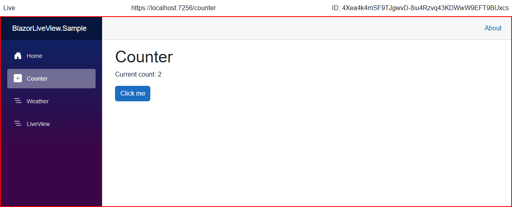

# Setup: Dashboard

This is the third step of BlazorLiveView setup: **Setting up the admin dashboard**.

This guide uses the pre-built dashboard components provided by the package `BlazorLiveView.Dashboard` (included in `BlazorLiveView`). To create custom dashboard components, see [Custom Dashboard](custom-dashboard.md).

## `LiveViewDashboard` Component

The `LiveViewDashboard` component displays a all active user circuits (connections) in a table.


Create a new Razor Component page for the dashboard, e.g. `Components/Pages/LiveViewDashboardPage.razor` with the following code.

```razor
@page "/liveview"
@using BlazorLiveView.Dashboard.Components

<PageTitle>LiveViewDashboardPage</PageTitle>
<h1>LiveViewDashboardPage</h1>

<LiveViewDashboard CircuitIdToLink="@CircuitIdToLink" />

@code {
    private string CircuitIdToLink(string circuitId, 
        bool debugView = false)
    {
        return $"/liveview/{circuitId}" 
            + $"{(debugView ? "?DebugView=true" : "")}";
    }
}
```

The `LiveViewDashboard` component expects a delegate `CircuitIdToLink` that generates a URL to the mirror view for a given circuit ID. You may pass this circuit ID in any way, but this guide uses a route parameter to pass the ID to a `LiveViewScreen` component.

## `LiveViewScreen` Component

The `LiveViewScreen` component renders the actual mirrored view of a user's session in a red box along with a top status bar with additional information.



Create a new Razor Component page for viewing individual sessions, e.g. `Components/Pages/LiveViewScreenPage.razor` with the following code.

```razor
@page "/liveview/{CircuitId}"
@using BlazorLiveView.Dashboard.Components
@layout BlazorLiveView.Dashboard.Layouts.EmptyLayout

<LiveViewScreen CircuitId="@CircuitId" DebugView="@DebugView" />

@code {
    [Parameter]
    public required string CircuitId { get; set; }

    [Parameter]
    [SupplyParameterFromQuery]
    public bool DebugView { get; set; } = false;
}
```

The `@layout` directive here is used to disable the default page layout so that the mirrored screen uses the full page width and height.

Note that the red box contains an `iframe` pointing to the _mirror endpoint_ mentioned in [Setup: Registering Services](setup-registering-services.md). Therefore the mirror endpoint must be secured alongside this page, since it can be accessed outside of this component.

## Navigation

For accessing the dashboard, add a link to your navigation menu, e.g. in `Components/Layout/NavMenu.razor`.

```razor
<div class="nav-item px-3">
    <NavLink class="nav-link" href="liveview">
        <span class="bi bi-list-nested-nav-menu" aria-hidden="true"></span> LiveView Dashboard
    </NavLink>
</div>
```

## Security

Both of the mentioned pages should be protected. They could be placed in the secured admin UI of your application or the `[Authorize]` attribute can be directly used like this:

```razor
@attribute [Authorize(Roles = "Administrator")]
```

## Next Steps

This completes the setup of BlazorLiveView. It should now work in your application.<br>
See [Utilities](utilities.md) for additional tools.
