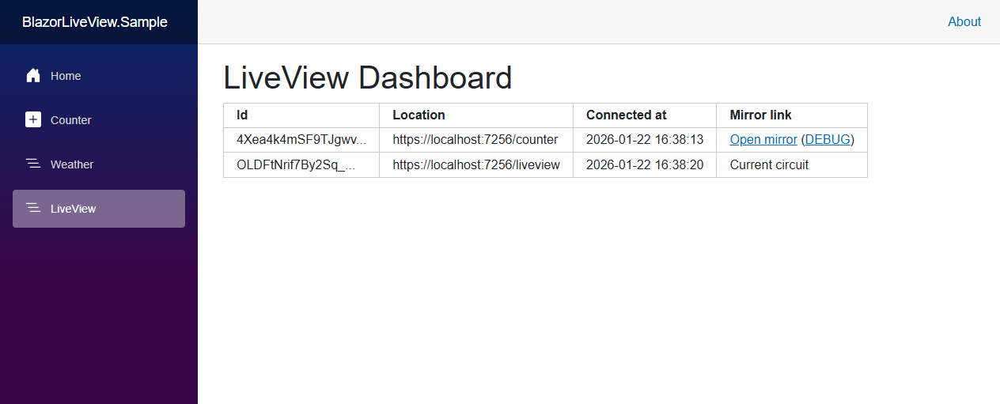
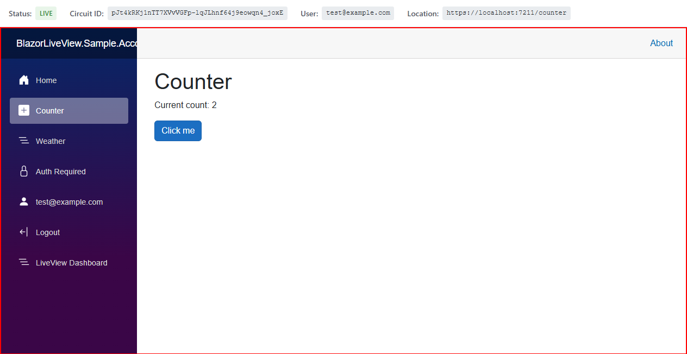

# Setup: Dashboard

This is the third step of BlazorLiveView setup: **Setting up the admin dashboard**.

This guide uses the pre-built dashboard components provided by the package `BlazorLiveView.Dashboard` (included in `BlazorLiveView`). To create custom dashboard components, see [Custom Dashboard](custom-dashboard.md).

## Circuits Table

The `LiveViewDashboard` component displays a all active user circuits (connections) in a table.



Create a new Razor Component page for the dashboard, e.g. `Components/Pages/LiveViewDashboardPage.razor` with the following code.

```csharp
@page "/liveview"
@using BlazorLiveView.Dashboard.Components

<PageTitle>LiveView</PageTitle>
<h1>LiveView Dashboard</h1>

<LiveViewDashboard CircuitIdToLink="@CircuitIdToLink"
                   UserSelectorToLink="@UserSelectorToLink"
                   ShowFullUrl="true" />

@code {
    private string CircuitIdToLink(string circuitId,
        bool debugView = false)
    {
        return $"/liveview/circuit/{circuitId}"
            + $"{(debugView ? "?DebugView=true" : "")}";
    }

    private string UserSelectorToLink(string userSelector,
        bool debugView = false)
    {
        return $"/liveview/user/{Uri.EscapeDataString(userSelector)}"
            + $"{(debugView ? "?DebugView=true" : "")}";
    }
}
```

The `LiveViewDashboard` component expects two delegates: `CircuitIdToLink` and `UserSelectorToLink`. They both should generate URL adresses to the mirror view. `CircuitIdToLink` for a given circuit ID and `UserSelectorToLink` for a given user selector (for example email). This guide uses route parameters to pass them to a single live view screen page.

## Live View Screen

Viewing the mirrored user session can be done with `LiveViewCircuitScreen` using a circuit ID or with `LiveViewUserScreen` using a user selector. Both of these components render the actual mirrored view of a user's session in a red box along with a top status bar with additional information.



Create a new Razor Component page, e.g. `Components/Pages/LiveViewScreenPage.razor` with the following code.

```csharp
@page "/liveview/circuit/{CircuitId}"
@page "/liveview/user/{UserSelector}"
@using BlazorLiveView.Dashboard.Components
@layout BlazorLiveView.Dashboard.Layouts.EmptyLayout

@if (!string.IsNullOrEmpty(CircuitId))
{
    <LiveViewCircuitScreen SourceCircuitId="@CircuitId"
                           DebugView="@DebugView" />
}
else if (!string.IsNullOrEmpty(UserSelector))
{
    <LiveViewUserScreen UserSelector="@UserSelector"
                        DebugView="@DebugView" />
}
else
{
    <p>Invalid parameters. Either CircuitId or UserSelector must be provided.</p>
}

@code {
    [Parameter]
    public string? CircuitId { get; set; }

    [Parameter]
    public string? UserSelector { get; set; }

    [Parameter]
    [SupplyParameterFromQuery]
    public bool DebugView { get; set; } = false;
}
```

The `@layout` directive here is used to disable the default page layout so that the mirrored screen uses the full page width and height.

Note that the red box contains an `iframe` pointing to the _mirror endpoint_ mentioned in [Setup: Registering Services](setup-registering-services.md). Therefore the mirror endpoint must be secured alongside this page, since it can be accessed outside of this component.

## Navigation

For accessing the dashboard, add a link to your navigation menu, e.g. in `Components/Layout/NavMenu.razor`.

```html
<div class="nav-item px-3">
    <NavLink class="nav-link" href="liveview">
        <span class="bi bi-list-nested-nav-menu" aria-hidden="true"></span> LiveView Dashboard
    </NavLink>
</div>
```

## Security

Both of the mentioned pages should be protected. They could be placed in the secured admin UI of your application or the `[Authorize]` attribute can be directly used like this:

```csharp
@attribute [Authorize(Roles = "Administrator")]
```

## CSS Styles

The default dashboard components use CSS styles that must be included using the Blazor's CSS bundling mechanism. Make sure to include the following line in `App.razor`:

```
<link href="@Assets["<ProjectName>.styles.css"]" rel="stylesheet" />
```

## Next Steps

This completes the setup of BlazorLiveView. It should now work in your application.<br>
See [Utilities](utilities.md) for additional tools.
