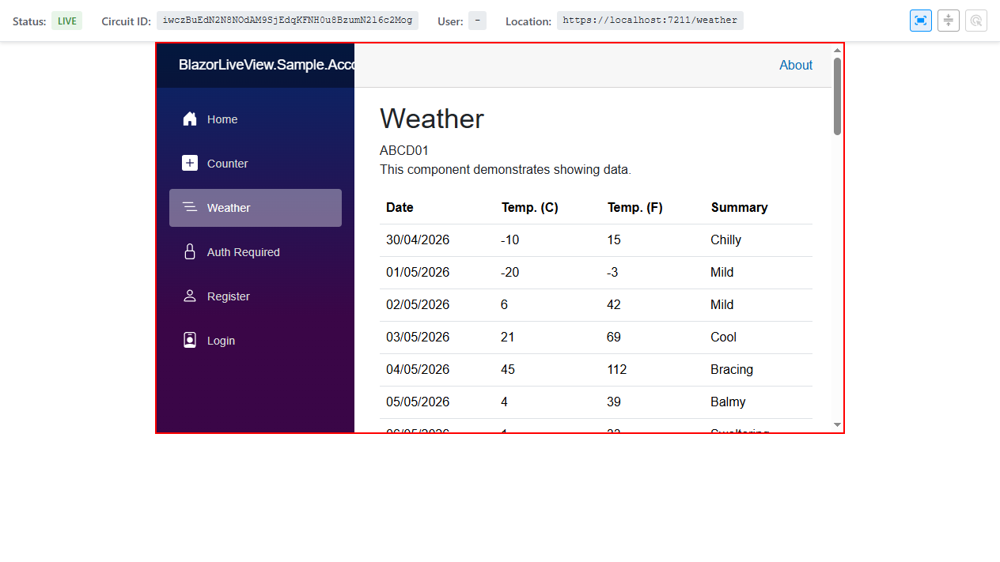
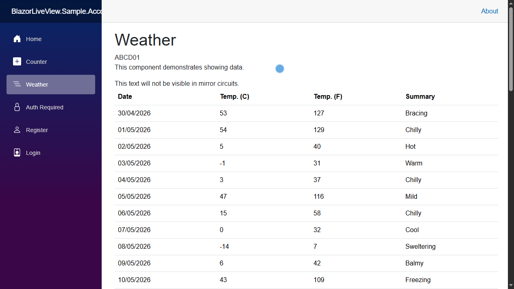

# Utilities

These are the attributes and components used to control how your application behaves when being mirrored in BlazorLiveView.

## Hiding Components in Mirror Views

When working with sensitive data (like personal information) you may want to hide them from being visible in the mirrored views.

### Using the Component

For hiding specific parts of the UI, you can wrap the content in a `LiveViewHideInMirror` component. For example:

```razor
<div class="user-dashboard">
    <h1>Welcome, @UserName</h1>

    Email: @UserEmail

    <LiveViewHideInMirror>
        Social Security Number: @UserSSN
    </LiveViewHideInMirror>
</div>
```

### Using the Attribute

For hiding entire components from being mirrored on any page, you can apply the `LiveViewHideInMirrorAttribute` to the component class. For example:

```razor
@* TwoFactorAuthComponent.razor *@

@using BlazorLiveView.Core.Attributes;
@attribute [LiveViewHideInMirror]

Your authentication code is: @AuthCode
```

## Remote Support Tools

There are three remote support tools available for administrators in the mirrored view like you can see in the screenshot below. These tools are:

1. _Window size sync_: Keeps the window size of the mirrored view in sync with the user's actual window size.
2. _Scroll position sync_: Keeps the scroll position of the mirrored view in sync with the user's actual scroll position. When this is active, the users cursor is shown to the administrator as a laser pointer.
3. _Laser pointer_: Shows a laser pointer to the user so that the administrator can point at specific parts of the UI in a remote support scenario.



