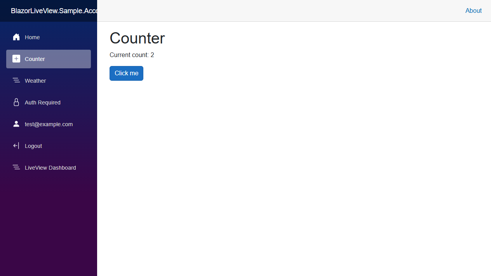
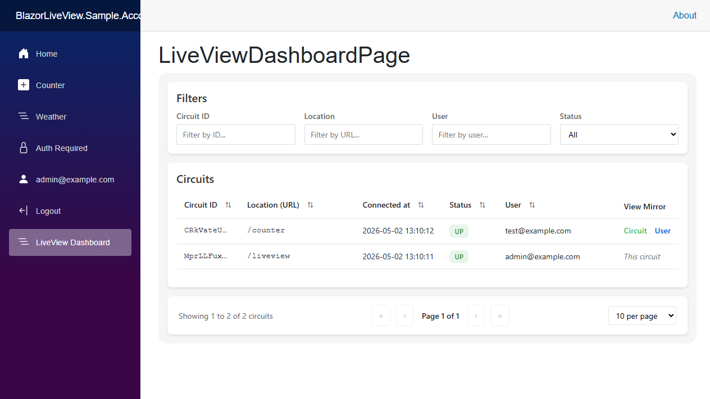
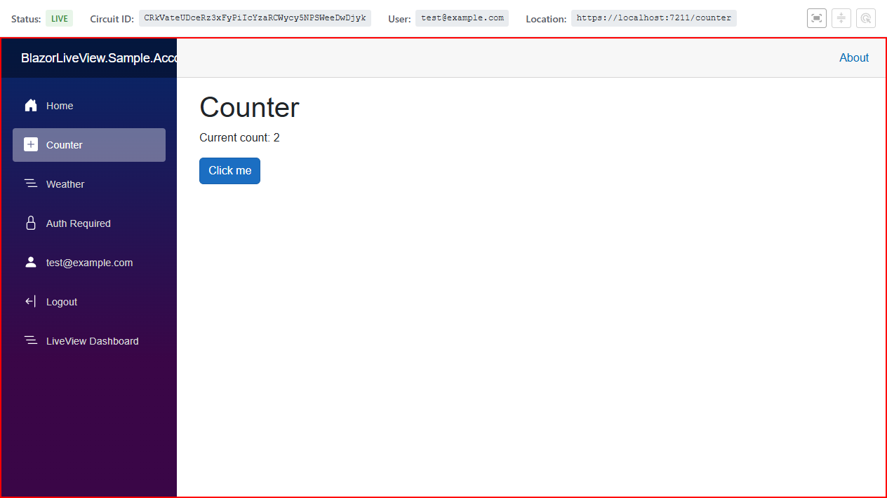
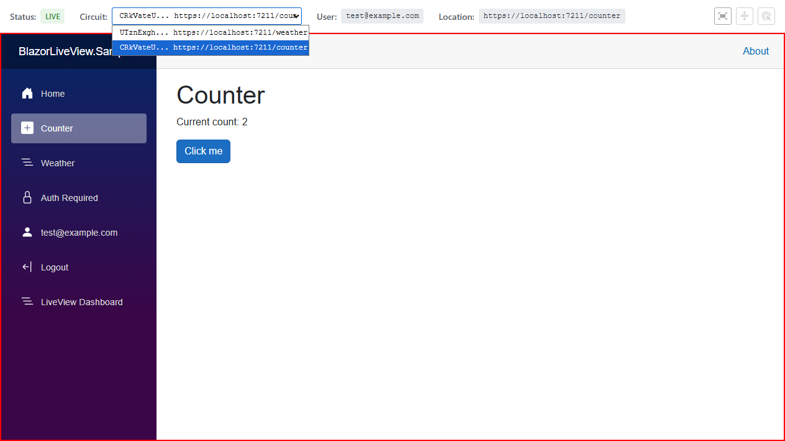
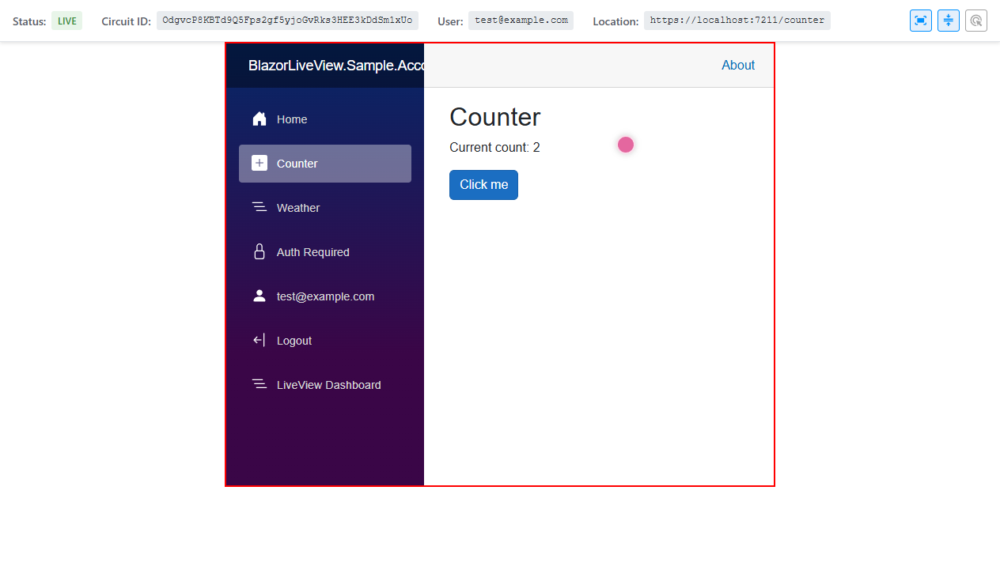

# BlazorLiveView

BlazorLiveView is a real-time screen sharing library for ASP.NET Core Blazor Server applications. It enables remote viewing of user sessions for debugging or remote assistance purposes. It is similar to remote desktop tools like TeamViewer, but native to Blazor Server applications.

## Showcase

Imagine the default Blazor Server application.

There is a regular user `test@example.com` on the counter page (URL `/counter`). Clicking on the button increases the counter value; the current value is **2**.

Using BlazorLiveView, administrators can view all active user connections (sessions) in the admin dashboard (URL `/liveview`). There are two connections shown:

1. The user on the counter page with URL `/counter`
2. The admin's own session with URL `/liveview`

Clicking on the link "Circuit" (in the column "View Mirror") redirects the admin to a page with a live mirror view of the user's session (URL `/liveview/circuit/{circuitId}`). Notice the original user's session shown in a red box (with the count **2**). There is also a top status bar with additional information. When the user clicks the button (increasing the count to **3**), the mirrored view updates in real-time.

In the admin dashboard, there is also a link "User" (in the column "View Mirror"). This is very similar to the "Circuit" view, but can show all circuits of the selected logged in user. The admin can switch between them using the dropdown in the top status bar. It also automatically switches to a newer circuit if the current has been closed. In this example, the user has two tabs open - `/counter` and `/weather`. 

When viewing a user session, the admin can use "Window size sync" and "Window scroll sync" options in the top status bar. When scroll sync is enabled, the user's cursor is shown. 

Additionally, the admin can use the "Laser pointer" option to show their cursor to the user.

## NuGet Packages

BlazorLiveView provides three NuGet packages:

- [**BlazorLiveView**](https://www.nuget.org/packages/BlazorLiveView) - Complete meta-package
- [**BlazorLiveView.Core**](https://www.nuget.org/packages/BlazorLiveView.Core) - Core functionality
- [**BlazorLiveView.Dashboard**](https://www.nuget.org/packages/BlazorLiveView.Dashboard) - Pre-built dashboard components to use with Core

## Links

- [GitHub Repository](https://github.com/i123iu/BlazorLiveView)

## Next Steps

See [Documentation](articles/index.md) to get started.
